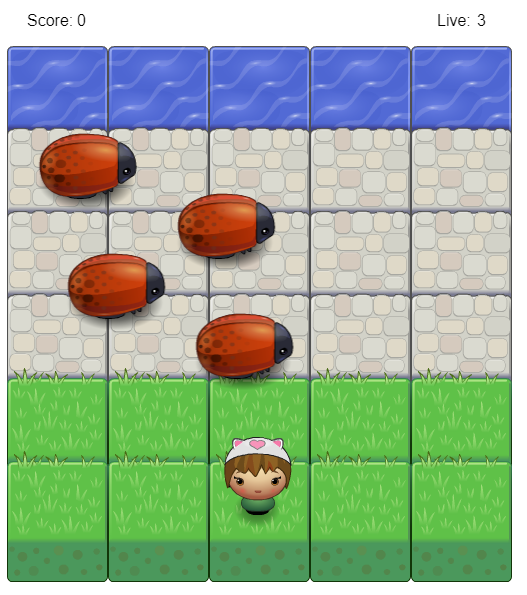
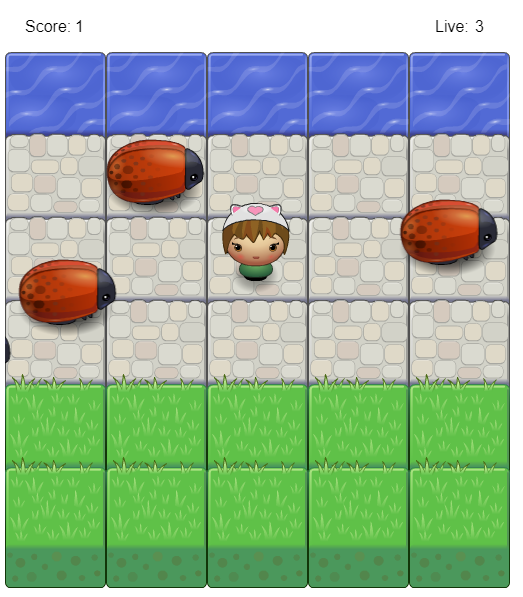
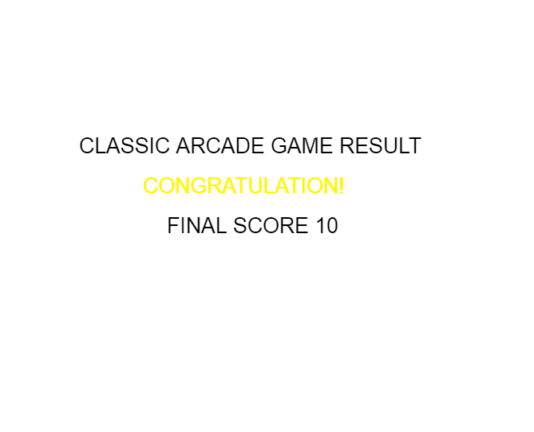
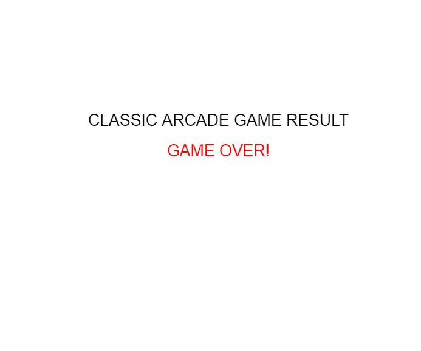

# Classic Arcade Game Project

## Table of Contents
* What Is Arcade Game
* Instructions
* How to play the game

## What Is Arcade Game
Arcade Game require a player to reach to the water in the top while avoiding bugs/enemies. 
If the player reached the wayer, a score will be inceased.
If the player reached bugs/enemies, a life will be decreased.

## How to Play The Game
### GitHub Project Demo
* Project Demo: [https://latifau.github.io/frontend-nanodegree-arcade-game-master/]
(https://latifau.github.io/frontend-nanodegree-arcade-game-master/ "GitHub Pages demo")
### GitHub Project Repository
* Download ZIP file from repository: [https://github.com/LatifaU/frontend-nanodegree-arcade-game-master/]
(https://github.com/LatifaU/frontend-nanodegree-arcade-game-master/ "GitHub project repository")
* Unzip file.
* Open index.html into browser.

## Instructions
* Try to reach the water
* Avoid bugs/enemies or else you will lose life
* You will win when you reach level 10
* You will lose when you reach 0 lives

## Screenshots

## Game Resources
### Udacity Arcade Game
* <https://github.com/udacity/frontend-nanodegree-arcade-game>
### HTML5 Canvas
* <https://www.w3schools.com/html/html5_canvas.asp>
* <https://www.w3schools.com/tags/canvas_font.asp>
### HandleInput function inspired by
<https://stackoverflow.com/questions/4416505/how-to-take-keyboard-input-in-javascript>
### To randomize speed
<https://developer.mozilla.org/en-US/docs/Web/JavaScript/Reference/Global_Objects/Math/random>

## Udacity Resources:
* Project Overview 
<https://classroom.udacity.com/nanodegrees/nd001-connect/parts/a200b283-bdf4-4e48-a1ca-353d01847d5f/modules/269645859775463/lessons/2696458597239847/concepts/25968188800923>
* Project Details
<https://classroom.udacity.com/nanodegrees/nd001-connect/parts/a200b283-bdf4-4e48-a1ca-353d01847d5f/modules/269645859775463/lessons/2696458597239847/concepts/26849785360923>
* Project Instructions
<https://classroom.udacity.com/nanodegrees/nd001-connect/parts/a200b283-bdf4-4e48-a1ca-353d01847d5f/modules/269645859775463/lessons/2696458597239847/concepts/59a9fe1d-cab4-4256-8479-4550ce4f4cfd>
* HTML5 Canvas Notes
<https://classroom.udacity.com/nanodegrees/nd001-connect/parts/a200b283-bdf4-4e48-a1ca-353d01847d5f/modules/269645859775463/lessons/2696458597239847/concepts/e23270c3-149f-45f6-803c-ff7162d10649>
* Project Specification
<https://review.udacity.com/#!/rubrics/15/view>